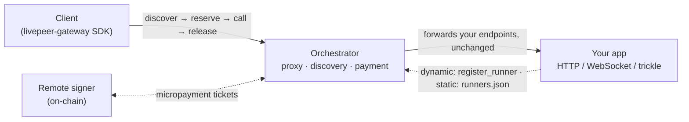
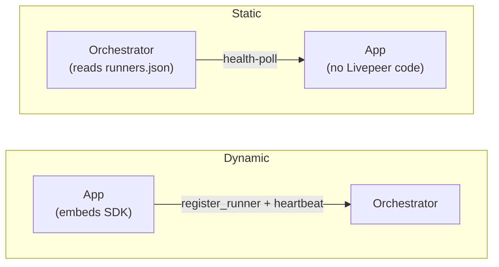

# Example apps for the Livepeer live runner

Example **apps that run on** the Livepeer **live runner** — [go-livepeer](https://github.com/livepeer/go-livepeer)'s new way to run any app on the network. Each app is a plain HTTP / WebSocket / video service: an orchestrator running the live runner **hosts** it, and a client **calls** it through the orchestrator with the [livepeer-gateway](https://github.com/livepeer/livepeer-python-gateway) **SDK**.

The point is to **swap the compute without changing your app — permissionlessly, no lock-in**. Your app stays a plain service with little or no Livepeer-specific code, so you're never tied to us. And the network is permissionless: anyone can run or extend it, no one gatekeeps what you deploy, and no single party can take your app down. Write the app once; **move the compute freely**.

> [!NOTE]
> Live runners aren't on go-livepeer `main` yet — they live on the [`ja/live-runner`](https://github.com/livepeer/go-livepeer/tree/ja/live-runner) branch. Until it merges, both the orchestrator image and the SDK come from that branch.

## How it works

Your app is a plain service that clients reach _through_ the orchestrator — the SDK handles discovery / session / payment, and, on-chain, a remote signer settles it. The client never talks to your app directly.



## Communication schemas

The orchestrator is a **transparent reverse proxy**: every endpoint you expose is passed through to your app unchanged, so you write an ordinary service and it runs on the network as-is. The transports supported today:

- **HTTP** request/response — the common case. (`hello-world`, `tiles`)
- **HTTP + SSE** — streamed / token responses. (`vllm`)
- **Trickle** — continuous realtime video in/out. (`echo`)
- **WebSocket** — long-lived bidirectional sessions. (external: `scope`)

Need a schema that isn't here? [Open an issue](https://github.com/livepeer/live-runner-example-apps/issues).

> [!IMPORTANT]
> SSE streaming (used by `vllm`) depends on gateway PR [#25](https://github.com/livepeer/livepeer-python-gateway/pull/25), not yet merged. Until it lands, streaming is only on the SDK's [`rs/live-runner-streaming`](https://github.com/livepeer/livepeer-python-gateway/tree/rs/live-runner-streaming) branch, not `ja/live-runner`.

## Examples

| Example                        | Goal                                            | Registration | Mode                               | Transport         |
| ------------------------------ | ----------------------------------------------- | ------------ | ---------------------------------- | ----------------- |
| [`hello-world`](./hello-world) | The simplest app: one request, one response     | dynamic      | persistent (single-shot by nature) | HTTP (JSON)       |
| [`tiles`](./tiles)             | Capacity fan-out — one session per tile         | dynamic      | persistent (single-shot by nature) | HTTP (base64 PNG) |
| [`echo`](./echo)               | Realtime video, transformed and echoed back     | dynamic      | persistent                         | trickle           |
| [`vllm`](./vllm)               | Drop-in OpenAI API; the client stays unmodified | static       | persistent (single-shot by nature) | HTTP + SSE        |

Start with `hello-world` (the smallest end-to-end path); the others each layer on one new idea. More will follow, including a full example that exercises every feature. Each is self-contained and runs **offchain** (free, no wallet); most also run **on-chain** (paid) — see each README.

## Registration

How the app attaches to the orchestrator:

- **Dynamic** — the app self-registers via the SDK (`register_runner`) and heartbeats; the orchestrator drops it when heartbeats stop. Best for apps that come and go. (`hello-world`, `echo`)
- **Static** — the orchestrator is configured with the app's URL in a `runners.json` and health-polls it; the app needs no SDK. Best for fixed, long-running deployments. (`vllm`)

The arrow flips — dynamic, the app announces itself; static, the orchestrator is told about a passive app:



## Runner modes

Chosen _at_ registration (above); **defaults to `persistent`** — set on both `register_runner(...)` and in `runners.json`. The examples set it explicitly.

- **Persistent** — a held-open session billed per second of wall-clock. Best for realtime / streaming. (`echo`)
- **Single-shot** — one request in, one response out. Best for batch / request-response. (`hello-world`, `vllm` are single-shot by nature.)

> [!IMPORTANT]
> Single-shot payment isn't implemented yet ([go-livepeer#3955](https://github.com/livepeer/go-livepeer/issues/3955)), so the single-shot-by-nature apps above register as **persistent**. On-chain that bills per second for the whole open session and overbills short calls — keep them **offchain-only** until #3955 lands ([#5](https://github.com/livepeer/live-runner-example-apps/issues/5)).

## Calling your app

The client side is the same shape for every app — **discover → reserve → call → release**:

1. **Discover** the app via the orchestrator's `/discovery`.
2. **Reserve** a session (`reserve_session`).
3. **Call** it — one `call_runner`, streamed frames, or a WebSocket, depending on transport.
4. **Release** the session (`stop_runner_session`), which settles payment on-chain.

Each example's `client.py` shows its exact calls — grep `# Livepeer:` to find them.

> [!NOTE]
> This is the flow today. Once single-shot lands ([#5](https://github.com/livepeer/live-runner-example-apps/issues/5)), we intend to abstract it into a single call — exact design TBD.

## External examples

Apps that integrate the live runner and live in their own repos — production deployments and standalone examples alike:

| Project                                                                    | What it is                                       | Transport           |
| -------------------------------------------------------------------------- | ------------------------------------------------ | ------------------- |
| [daydreamlive/scope](https://github.com/daydreamlive/scope/tree/ja/runner) | Real-time AI video with downloadable LoRA models | WebSocket + trickle |

Built one? [Open a PR](https://github.com/livepeer/live-runner-example-apps/compare) to list it here.

## Running the examples

Each example is self-contained and its README has the run commands. Everything below is the **shared setup** they all build on — the examples spin up a local orchestrator (and, on-chain, a signer) via the compose files here, so you set this up once, not per example.

### Prerequisites

- **Docker** for the end-to-end demos. They use the `livepeer/go-livepeer:ja-live-runner` image, so there is nothing to build.
- **Python 3.12+** and [`uv`](https://docs.astral.sh/uv/) for the client.
- The **`livepeer-gateway` SDK** from the `ja/live-runner` branch (not yet on PyPI):

  ```sh
  pip install "git+https://github.com/livepeer/livepeer-python-gateway@ja/live-runner"
  ```

### Shared components

The orchestrator and signer services are defined once at the repo root and pulled into each example with Docker Compose `extends`, so examples don't duplicate them:

- `compose.orchestrator.yml` — the offchain orchestrator (`-useLiveRunners`).
- `compose.onchain.yml` — adds a remote signer and re-points the orchestrator on-chain.

### On-chain (paid) setup

On-chain runs add a **remote signer** that holds the payer wallet and mints [probabilistic micropayment](https://medium.com/livepeer-blog/a-primer-on-livepeers-probabilistic-micropayments-e16788b29331) tickets; the orchestrator redeems the winning ones. Shared across examples:

- **Wallets stay outside the repo** — `*_KEYSTORE_DIR` points at go-livepeer keystores (mounted read-only); only the address + password come from `.env`.
- **`.env` is per example and gitignored** — copy `.env.example` and fill in RPC, network, keystore paths, accounts, and pricing (it holds the keystore password).
- **Runner price is decimal USD per hour**: the app advertises `PRICE` (e.g. `0.01`); `currency` and `unit` default to `usd` / `hour`, so only `price` is required. The orchestrator converts it to wei per second via the price feed. The signer caps what it will pay at `MAX_PRICE_PER_UNIT`, which is priced per **second** of runtime (0.000111USD is about 0.40 USD/hour).
- **Payments are probabilistic** — on a short run you'll rarely see a redemption; that's expected.

### Verifying discovery

Before running a client, confirm the orchestrator actually advertises your runner with the expected price by calling `/discovery` directly:

```sh
curl -sk https://localhost:8935/discovery | jq
```

Each entry lists its `runners` with an `app`, `version`, capacity, and `price_info`. The orchestrator republishes your USD/hour price converted to wei — `price` in wei with `currency: wei` and `unit: seconds` (or `720p-pixel-seconds` for per-pixel video). Check that your app appears and the price is non-zero.

### Conventions

- Apps bind to `127.0.0.1` by default (safe for local runs). In a container the compose files pass `--host=0.0.0.0` so the orchestrator can reach the app.
- Orchestrators serve a self-signed TLS cert; the SDK skips verification.

## Contributing

Issues and PRs welcome — see [CONTRIBUTING.md](./CONTRIBUTING.md).
