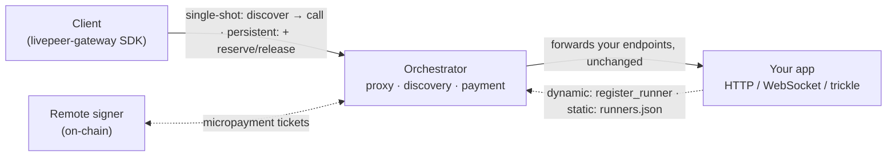
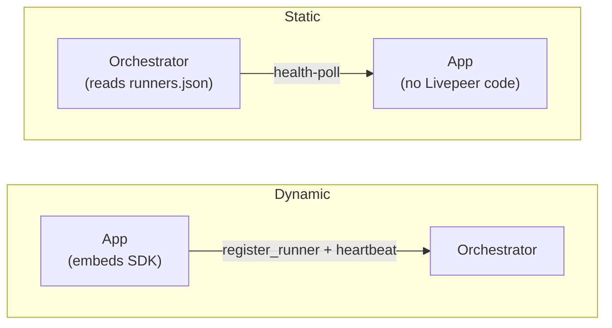

# Example apps for the Livepeer live runner

Example **apps that run on** the Livepeer **live runner** — [go-livepeer](https://github.com/livepeer/go-livepeer)'s new way to run any app on the network, shipping in mainline since [v0.9.0](https://github.com/livepeer/go-livepeer/releases/tag/v0.9.0). Each app is a plain HTTP / WebSocket / video service: an orchestrator running the live runner **hosts** it, and a client **calls** it through the orchestrator with the [livepeer-gateway](https://github.com/livepeer/livepeer-python-gateway) **SDK**.

The point is to **swap the compute without changing your app**, permissionlessly and with no lock-in. Your app stays a plain service with little or no Livepeer-specific code, so you're never tied to us. And the network is permissionless: anyone can run or extend it, no one gatekeeps what you deploy, and no single party can take your app down. Write the app once; **move the compute freely**.

## Quick start

Try it locally. Free, no wallet:

```sh
cd hello-world
docker compose up -d --build   # orchestrator + the app
uv run client.py               # call it through the orchestrator
docker compose down
```

## How it works

Your app is a plain service that clients reach _through_ the orchestrator. The SDK handles discovery / session / payment, and, on-chain, a remote signer settles it. The client never talks to your app directly.



## Transports

The orchestrator is a **transparent reverse proxy**: every endpoint you expose is passed through to your app unchanged, so you write an ordinary service and it runs on the network as-is. The transports supported today:

- **HTTP** request/response — the common case. (`hello-world`, `tiles`, `api-proxy`, `notepad`)
- **HTTP + SSE** — streamed / token responses. (`vllm`)
- **Trickle** — continuous realtime video in/out. (`echo`)
- **WebSocket** — long-lived bidirectional sessions. (`realtime-transcription`)

Need a transport that isn't here? [Open an issue](https://github.com/livepeer/runner-app-examples/issues).

## Examples

| Example                                              | Goal                                                                                     | Registration | Mode        | Transport         | Pricing |
| ---------------------------------------------------- | ---------------------------------------------------------------------------------------- | ------------ | ----------- | ----------------- | ------- |
| [`hello-world`](./hello-world)                       | The simplest app: one request, one response                                              | dynamic      | single-shot | HTTP (JSON)       | fixed   |
| [`tiles`](./tiles)                                   | Capacity fan-out — one call per tile                                                     | dynamic      | single-shot | HTTP (base64 PNG) | fixed   |
| [`api-proxy`](./api-proxy)                           | Pass calls through to hosted APIs — the operator holds the key, one capability per model | static       | single-shot | HTTP (JPEG bytes) | fixed   |
| [`echo`](./echo)                                     | Realtime video, transformed and echoed back                                              | dynamic      | persistent  | trickle           | hour    |
| [`notepad`](./notepad)                               | Held-open HTTP session with process-local state                                          | dynamic      | persistent  | HTTP (JSON)       | hour    |
| [`vllm`](./vllm)                                     | Drop-in OpenAI API; the client stays unmodified                                          | static       | single-shot | HTTP + SSE        | hour    |
| [`realtime-transcription`](./realtime-transcription) | Audio up, transcripts back, on one socket                                                | dynamic      | persistent  | WebSocket         | hour    |

Start with `hello-world` (the smallest end-to-end path); the others each layer on one new idea. More will follow, including a full example that exercises every feature. Each is self-contained and runs **offchain** (free, no wallet); most also run **on-chain** (paid) — see each README.

This set stays **minimal and curated**: it covers each value of the axes above (registration, mode, transport, pricing), not one example per app. New examples land here only when they fill a gap in that table — apps built on the runner belong in their own repos, listed under [External examples](#external-examples).

## Registration

How the app attaches to the orchestrator:

- **Dynamic** — the app self-registers via the SDK (`register_runner`) and heartbeats; the orchestrator drops it when heartbeats stop. Best for apps that come and go. (`hello-world`, `echo`, `notepad`, `realtime-transcription`)
- **Static** — the orchestrator is configured with the app's URL in a `runners.json` and health-polls it; the app needs no SDK. Best for fixed, long-running deployments. (`vllm`, `api-proxy`)

The arrow flips: dynamic, the app announces itself; static, the orchestrator is told about a passive app:



Both forms also take an optional **`metadata`** string: up to 1 KB of app-controlled UTF-8 for detail the protocol doesn't model, echoed in `/discovery` and never read by the orchestrator. **Discovery and selection ignore it**, filtering only on `app` and `gpu`, so anything a caller selects or pays differently for belongs in the app id instead. That is why no example here uses it.

<details>
<summary>Reading <code>metadata</code> from the client</summary>

Clients read it off the discovered runner, whose `raw` holds that runner's discovery entry: `cursor.candidates[0].raw["metadata"]` after `runner_selector`, `session.runner.raw["metadata"]` after `reserve_session`.

</details>

## Runner modes

Chosen _at_ registration (above); **defaults to `persistent`**, set on both `register_runner(...)` and in `runners.json`. The examples set it explicitly.

- **Persistent** — a held-open session the client reserves and releases, billed per second of wall-clock (or once, with fixed pricing). Best for realtime / streaming. (`echo`, `notepad`, `realtime-transcription`)
- **Single-shot** — one request in, one response out; the orchestrator reserves a session per call and releases it when the response returns, so the client manages no session at all. Best for batch / request-response. With metered pricing the call pays for as long as it runs, so the work need not be short. (`hello-world`, `tiles`, `api-proxy`, `vllm`)

## Calling your app

The client side depends on the runner's mode:

- **Single-shot** — **discover → call**: find the app via `runner_selector`, then one `call_runner`. The orchestrator reserves a session for the call and releases it when the response returns; on the paid path `call_runner` answers the 402 payment challenge inline. (`hello-world`, `tiles`, `api-proxy`, `vllm`)
- **Persistent** — **discover → reserve → call → release**: reserve a session (`reserve_session`), call it — `call_runner`, streamed frames, or a WebSocket, depending on transport — then release it (`stop_runner_session`), which settles payment on-chain. (`echo`, `notepad`, `realtime-transcription`)

Each example's `client.py` shows its exact calls: grep `# Livepeer:` to find them.

## Shared setup

Each example is self-contained and its README has the run commands. Everything below is the setup they all build on: the examples spin up a local orchestrator (and, on-chain, a signer) via the compose files here, so you set this up once, not per example.

### Prerequisites

- **Docker** for the end-to-end demos, so there is nothing to build. They run the `livepeer/go-livepeer:v0.9.1` release image.
- **Python 3.12+** and [`uv`](https://docs.astral.sh/uv/) for the client.
- The **[`livepeer-gateway` SDK](https://pypi.org/project/livepeer-gateway/)**. `uv run` installs it for you from each app's `pyproject.toml`, so you only need this to install it yourself:

  ```sh
  pip install "livepeer-gateway>=1.0.0"
  ```

### Shared components

The orchestrator and signer services are defined once at the repo root and pulled into each example with Docker Compose `extends`, so examples don't duplicate them:

- `compose.orchestrator.yml` — the offchain orchestrator (`-useLiveRunners`).
- `compose.onchain.yml` — adds a remote signer and re-points the orchestrator on-chain.

### Images

Each example ships a `Dockerfile` and a `compose.yml` that builds it locally. Those with a `Dockerfile` are also published to the GitHub Container Registry as `ghcr.io/livepeer/runner-example-<name>` (`linux/amd64`), linked from the example's own README. Tags: `latest` (current `main`), `stable` (latest `v*` release), `1.2` / `1.2.3`, `sha-<short>`.

The packages are public, so no login is needed. `compose.yml` always builds; one flag runs the published image instead:

```sh
docker compose up -d --pull always
```

### On-chain (paid) setup

On-chain runs add a **remote signer** that holds the payer wallet and mints [probabilistic micropayment](https://medium.com/livepeer-blog/a-primer-on-livepeers-probabilistic-micropayments-e16788b29331) tickets; the orchestrator redeems the winning ones. Shared across examples:

- **Wallets stay outside the repo** — `*_KEYSTORE_DIR` points at go-livepeer keystores (mounted read-only); only the address + password come from `.env`.
- **`.env` is per example and gitignored** — copy `.env.example` and fill in RPC, network, keystore paths, accounts, and pricing (it holds the keystore password).
- **Runner price is a plain USD amount**: the app advertises `PRICE` (e.g. `0.01`). `currency` and `unit` default to `usd` / `hour`, so only `price` is required. With `hour` the orchestrator converts it to wei via the price feed and meters the session per second. Apps with bounded per-call work can register `unit="fixed"` to bill the price once per session (see hello-world, tiles). The signer caps what it pays at `MAX_PRICE_PER_UNIT`, compared per billing unit: one second of runtime when metered (0.000111USD is about 0.40 USD/hour), the whole session price when fixed.
- **Payments are probabilistic** — on a short run you'll rarely see a redemption; that's expected.
- **`--discovery` and `--signer` answer different questions**: where the runners are, and who pays. The demo signer runs without `-remoteDiscovery`, so the clients point discovery straight at the local orchestrator. A signer started with that flag serves `/discover-orchestrators` itself, and the SDK falls back to it whenever no discovery URL is given. Since the clients default `--discovery` to the local orchestrator, reaching that fallback takes `--discovery ''`.

### Verifying discovery

Before running a client, confirm the orchestrator actually advertises your runner with the expected price by calling `/discovery` directly:

```sh
curl -sk https://localhost:8935/discovery | jq
```

Each entry lists its `runners` with an `app`, `version`, capacity, and `price_info`. The orchestrator republishes your USD price converted to wei — `price` in wei with `currency: wei` and `unit: seconds` (`720p-pixel-seconds` for per-pixel video, `fixed` for once-per-session pricing). Check that your app appears and the price is non-zero.

### Conventions

- Apps bind to `127.0.0.1` by default (safe for local runs). In a container the compose files pass `--host=0.0.0.0` so the orchestrator can reach the app.
- Orchestrators serve a self-signed TLS cert; the SDK skips verification.

## External examples

Apps that integrate the live runner and live in their own repos — production deployments and standalone examples alike. This table is links-only: the code, CI, and support stay with the author.

| Project                                                                                                 | What it is                                                                                            | Transport           |
| ------------------------------------------------------------------------------------------------------- | ----------------------------------------------------------------------------------------------------- | ------------------- |
| [daydreamlive/scope](https://github.com/daydreamlive/scope/tree/ja/runner)                              | Real-time AI video with downloadable LoRA models                                                      | WebSocket + trickle |
| [livepeer/api-proxy](https://github.com/livepeer/api-proxy)                                             | Attach several API endpoints dynamically — key storage and request stats for operators                | HTTP                |
| [Gideonjon/vllm-realtime-livepeer-runner](https://github.com/Gideonjon/vllm-realtime-livepeer-runner)   | Real-time speech-to-text — trickle audio in, WebSocket transcript out, with live metrics              | WebSocket + trickle |
| [livepeer/streamdiffusion-livepeer-runner](https://github.com/livepeer/streamdiffusion-livepeer-runner) | Realtime prompt-driven img2img — a third-party StreamDiffusion server run unmodified, reverse-proxied | WebSocket + HTTP    |

**Building one?** Start from [**template-livepeer-runner**](https://github.com/livepeer/template-livepeer-runner) — a working app, client, and compose setup you can run in one command, offchain or on-chain. The examples here are not copyable as-is: each one's `compose.yml` pulls the orchestrator from a shared file one directory up.

Then [open a PR](https://github.com/livepeer/runner-app-examples/compare) that adds a row. To make your repo easy to find, follow the community convention (the template's README walks through it):

- Name the repo `<app>-livepeer-runner` (e.g. `comfyui-livepeer-runner`).
- Add the `livepeer-runner` GitHub topic.
- Mention Livepeer in the repo description.

## Contributing

Issues and PRs welcome. See [CONTRIBUTING.md](./CONTRIBUTING.md).
